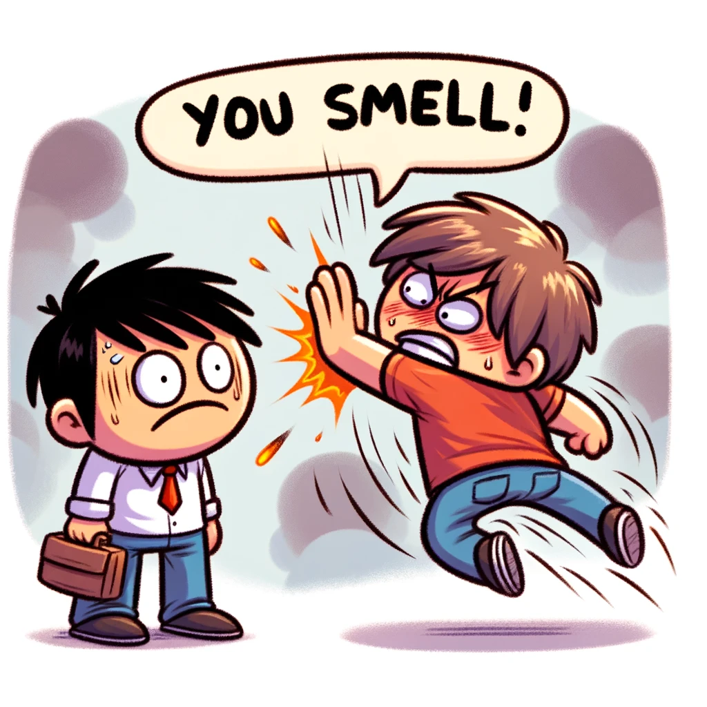
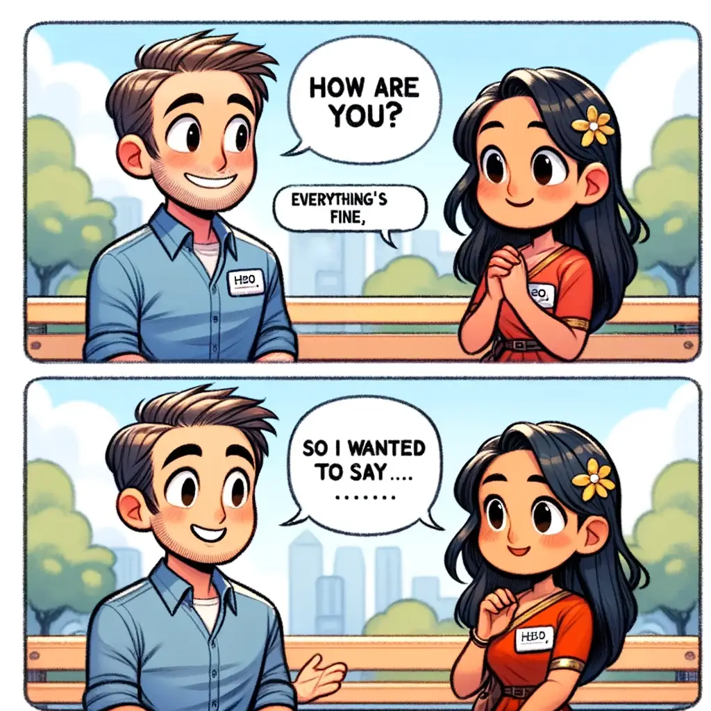
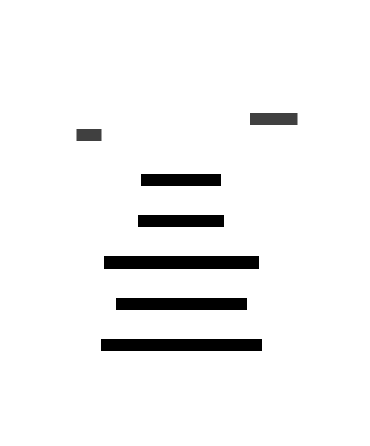
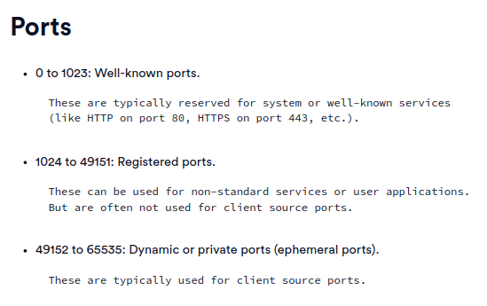

# TCP over UDP

This is an educational project more than anything else.

It's about how you can create the TCP protocol ([RFC 9293](https://datatracker.ietf.org/doc/html/rfc9293#name-send-call)),
over UDP.

## Is it complete?

No.

But the principles are there for you to read.

## How to run it?

```sh
make build
./server <address> <port>
```

## What is an Internet Communication Protocol

Protocol is a way of communication, just like any other natural or programming language. Everything is a protocol for how we should communicate with each other. Computers though need something, more precise and surely much more safe to use.

## What is UDP

UDP is a protocol of internet communication, defined by [RFC 768](https://datatracker.ietf.org/doc/html/rfc768)

UDP is the simplest protocol you can get. It's like UPS throwing your package from Amazon (not affiliated) to your door without even knocking your door first to even see if you even still live there.


## What is TCP

It's an Internet Protocol like UDP.

TCP is built on top of UDP.

Unlike UDP, TCP makes sure your packets/packages are transferred and that you acknowledged the communication, and that every communication that happens, happens on good terms.

Unlike QUIC (another protocol) which HTTP 3.0 is being built on, it does not handle the **encryption** part though and many other cases. It's an old protocol from the 80's. But it is still being used almost everywhere.

## Flags

A flag is what a client and the server sends to communicate on what stage of the communication they're at.

Like, the same way you don't go to a random pedestrian on the street and say "Hey you smell". Firstly, that would be rude, secondly that pedestrian will probably slap you. Same goes for a TCP server. Or maybe you would, for a "social experiment". I don't judge. I mean I do, but you do you.

<p align="center">
    
</p>


- **SYN** - Synchronize. Just saying that "dude I wanna talk to you". Goes both ways for initiating a connection.
- **SEQ** - Sequence number. **Initially**, both the **server** and the **client** create a **random number**. Why? That was exactly my question. The reason is security. A 3rd party cannot know the sequence number if it doesn't always start from 0. Like, in a normal conversation you would say "Hello, this is my first message", but in this case you're trying to confuse the caller by saying "We've talked about this before" so the 3rd party has no freaking way of knowing what you were talking about and if you're lying and how much you're lying. So, they can't join the conversation, because you as a server or client, will know immediately they're lying, they had no idea what you were talking about and on what part of the conversation you were in.
- **ACK** - Acknowledge. Saying "Okay buddy, I acknowledge you, I'll also send you an **ACK number** which initially will be equally to **SEQ+1** and then it will always be a byte more than what was last sent or the last packet's length I acknowledged. From then and on, as long as the user has TCP data packets to send to the server, the `server ACK number = client SEQ number + 1`. So, the client says `SEQ = 100`, then the server sends back `ACK = 101`.

<p align="center">
    
</p>

## First interaction: 3 way handshake

1. **Client** sents a **SYN** flag with a random **SEQ** number.
2. **Server** Acknowledges the SYN with a **SYN,ACK** flag - says "okay, you generated a random SEQ, now I want SEQ+1, I'll tell you that by sending you ACK=SEQ+1, and I will also generate my own **server SEQ** with flags `SYN,ACK` (Synchronize, Acknowledge).
3. **Client** Acknowledges the server's sequence number as well, and its acknowledge number. So, it sends `server SEQ number` and the `server ACK number` along with the flags `ACK`. `SYN` is no longer sent since the client already told that "hey I wanna talk with you", no longer need to repeat that saying unless you have special conditions but computers don't have mental illnesses afaik.
4. **Client** Says "Okay bro, you're good, I'm good, let's do business, I'll send data to you". So, client starts sending data, along with the `client SEQ number, ACK=(server SEQ number)+1` along with flags `ACK,DATA` to say "okay I acknowledged your last handshake, now I'm sending data".

<p align="center">
    
</p>

## What happens if

- **Server suddenly restarts?**
    If a tcp server closes while it has open connections, then what happens is:

    Each connection has: (client IP, client Port).
    The server stores all the connections. So, it knows to which connections it has made a bond with with a 3 way handshake.
    If that combination of (client IP, client Port) doesn't match any existing connection already, and the client sends `ACK,DATA` which means the client thinks it has a "bond" with the server and has already established a 3 way handshake, then the server says "nah hommy, you not mine I don't remember you" by having a **Silent timeout** usually of 2 minutes. So, the server won't respond to that combination of client IP and client Port for 2 minutes (per RFC).

    This, doesn't mean that the same client can't send again on the server for TIME_WAIT (2 minutes usually).

    It just means that they can't send via the same port for that time.

    **Let me explain this more thoroughly, regarding the client ports**

    Each machine has 65535 ports available. BOTH for client connections, and server connections.

    By which I mean, all those ports, are both so you can be a server for something, and client of other services.

    **Well known ports 0-1024** - reserved for the most used apps, like HTTP (80) or SSH (21) etc.
    So, unless you want to abuse those by using system administrator privilleges, or having a webserver like NGINX, or an SSH server, you usually don't use those directly.
    
    **Registered ports 1024-49151** - These can be used for non-standard services or user applications but are often not used for client source ports. They're usually used to serve something from your end as a machine, you're a machine, right? You don't have any friends, you're reading somebody's interpretation of the TCP protocol, so it's as close as it gets anyway.
    
    Dynamic or private ports (ephemeral ports): 49152 to 65535. These are typically used for **client source ports**.

    So, usually your program of choice when it initiates a TCP/UDP/whatever connection with another machine, it usually picks one of those ports, which are total 16383 ports. So, for example if you wanted to have the maximum number of postgres/mongodb/http connections to servers, that would typically be at most 16383, unless you're ready to start abusing the other ports as well.

<p align="center">
    
</p>
